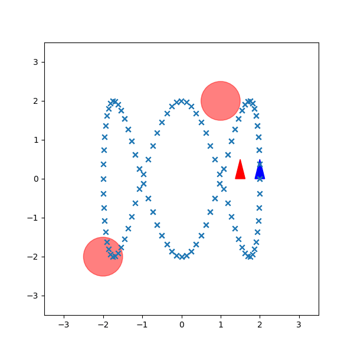

# Model Predictive Control and Infinite-Horizon Stochastic Optimal Control

# Overview
This project utilizes Model Predictive Control (MPC) and Generalized Policy Iteration (GPI) to compute a control policy for an agent to follow a reference trajectory. Our agent is expected to avoid obstacles while having its motion be affected by noise.

# Implementation
This was implemented in Python using NumPy. The code has been redacted, if you wish to see it, you may contact me at charles.lychee@gmail.com

# Results
## Model Predictive Control (MPC)
### Time Horizon = 20

### Time Horizon = 70

## Generalized Policy Iteration (GPI)
### Discount Factor = 0.9

### Discount Factor = 0.99

# Mathematical Approach (WIP)
